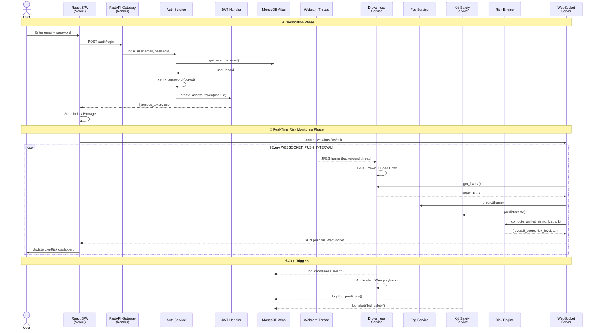
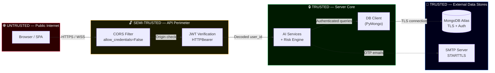
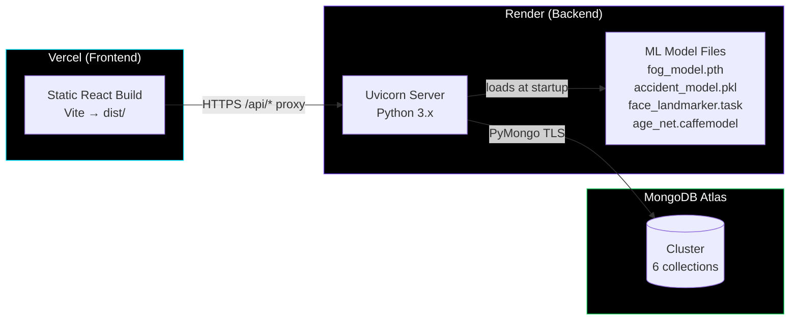

# 🏗️ Runtime Architecture — Smart AI Driver Safety System

> **Source of truth:** All components, data flows, and boundaries are derived directly from the repository code.

---

## High-Level Architecture Diagram

```mermaid
graph TB
    subgraph TRUST_BOUNDARY_CLIENT["🔓 Trust Boundary: Client (Browser)"]
        direction TB
        FE["🖥️ React + Vite Frontend<br/><i>Vercel (Static SPA)</i>"]
        WS_CLIENT["🔌 WebSocket Client<br/><i>LiveRisk.jsx</i>"]
    end

    subgraph TRUST_BOUNDARY_SERVER["🔒 Trust Boundary: Backend (Render)"]
        direction TB
        
        subgraph API_GATEWAY["FastAPI Application Gateway"]
            CORS["CORS Middleware"]
            AUTH_MW["JWT Auth Guard<br/><i>HTTPBearer + decode_access_token</i>"]
        end

        subgraph AUTH_LAYER["🔐 Authentication Layer"]
            AUTH_ROUTES["Auth Routes<br/><i>/auth/*</i>"]
            AUTH_SVC["Auth Service<br/><i>register, login</i>"]
            JWT["JWT Handler<br/><i>HS256, create/decode tokens</i>"]
            OTP_SVC["OTP Service<br/><i>6-digit, email or console</i>"]
            HASH["Password Hasher<br/><i>bcrypt</i>"]
        end

        subgraph DETECTION_ENGINE["🧠 AI Detection Engine"]
            DROWN["Drowsiness Service<br/><i>MediaPipe FaceLandmarker<br/>EAR + Yawn + Head Pose</i>"]
            FOG["Fog Service<br/><i>EfficientNet-B0 (timm)<br/>PyTorch inference</i>"]
            STRESS["Stress Service<br/><i>Audio analysis</i>"]
            VIS["Visibility Service<br/><i>Brightness/Contrast/Blur<br/>+ Child Presence</i>"]
            KID["Kid Safety Service<br/><i>OpenCV DNN<br/>Age estimation</i>"]
            EMOTION["Emotion Detection<br/><i>TensorFlow/Keras CNN<br/>7 emotion classes</i>"]
            ACCIDENT["Accident Predictor<br/><i>XGBoost + LabelEncoder<br/>joblib model</i>"]
        end

        subgraph RISK_LAYER["⚡ Risk Aggregation"]
            RISK["Unified Risk Engine<br/><i>Weighted multi-factor scoring<br/>0–100 scale, 4 levels</i>"]
        end

        subgraph REALTIME_LAYER["📡 Real-Time Layer"]
            WS_SERVER["WebSocket Server<br/><i>/ws/risk</i>"]
            AUDIO["Audio Alert Service<br/><i>WAV playback thread</i>"]
        end

        subgraph DATA_ROUTES["📊 API Routes"]
            API_ROUTES["REST API Router<br/><i>/api/* (protected)</i>"]
            ANALYTICS["Analytics Service<br/><i>Summary + Safety Score</i>"]
        end

        WEBCAM["📷 Webcam Thread<br/><i>Background capture<br/>JPEG frame buffer</i>"]
    end

    subgraph TRUST_BOUNDARY_EXTERNAL["🌐 Trust Boundary: External Services"]
        MONGO[("🍃 MongoDB Atlas<br/><i>Cloud Database</i>")]
        SMTP["📧 SMTP Server<br/><i>OTP Email Delivery</i>"]
        MEDIAPIPE["☁️ MediaPipe Models<br/><i>Google Storage CDN</i>"]
        OPENCV_MODELS["☁️ OpenCV DNN Models<br/><i>GitHub Raw (LearnOpenCV)</i>"]
    end

    %% ── Primary Request Flow (Login → Dashboard → Live Risk) ──
    FE -->|"1. POST /auth/login<br/>(email + password)"| CORS
    CORS --> AUTH_ROUTES
    AUTH_ROUTES --> AUTH_SVC
    AUTH_SVC --> HASH
    AUTH_SVC --> JWT
    AUTH_SVC -->|"lookup user"| MONGO
    JWT -->|"2. JWT token ←"| FE

    FE -->|"3. GET /api/risk<br/>(Bearer token)"| CORS
    CORS --> AUTH_MW
    AUTH_MW -->|"validate JWT"| JWT
    AUTH_MW --> API_ROUTES
    API_ROUTES -->|"query all modules"| DROWN
    API_ROUTES --> FOG
    API_ROUTES --> STRESS
    API_ROUTES --> VIS
    API_ROUTES --> KID
    API_ROUTES -->|"4. compute_unified_risk()"| RISK
    RISK -->|"5. risk JSON ←"| FE

    %% ── WebSocket real-time push ──
    WS_CLIENT <-->|"6. ws://host/ws/risk<br/>(persistent push)"| WS_SERVER
    WS_SERVER -->|"poll every tick"| DROWN
    WS_SERVER --> FOG
    WS_SERVER --> VIS
    WS_SERVER --> KID
    WS_SERVER --> RISK

    %% ── Camera → Detection pipeline ──
    WEBCAM -->|"JPEG frames"| DROWN
    DROWN -->|"latest frame"| FOG
    DROWN -->|"latest frame"| VIS
    DROWN -->|"latest frame"| KID
    DROWN -->|"EAR/yawn alert"| AUDIO
    DROWN -->|"log events"| MONGO

    %% ── Model weight sources ──
    MEDIAPIPE -.->|"face_landmarker.task<br/>(downloaded at startup)"| DROWN
    OPENCV_MODELS -.->|"age_net + face_detector<br/>(auto-downloaded)"| KID

    %% ── External writes ──
    FOG -->|"log fog predictions"| MONGO
    KID -->|"log kid alerts"| MONGO
    EMOTION -->|"log emotion events"| MONGO
    ANALYTICS -->|"read alerts/events"| MONGO

    %% ── OTP / Password Reset flow ──
    AUTH_ROUTES -->|"forgot-password"| OTP_SVC
    OTP_SVC -->|"store OTP"| MONGO
    OTP_SVC -->|"send OTP email"| SMTP

    %% ── Accident prediction (standalone) ──
    FE -->|"POST /api/accident/predict"| API_ROUTES
    API_ROUTES --> ACCIDENT

    %% Styling
    classDef frontend fill:#1a1a2e,stroke:#00e5ff,stroke-width:2px,color:#e0e0e0
    classDef backend fill:#16213e,stroke:#7c4dff,stroke-width:2px,color:#e0e0e0
    classDef ai fill:#0d1b2a,stroke:#ff6f00,stroke-width:2px,color:#e0e0e0
    classDef risk fill:#1b0a2e,stroke:#ff1744,stroke-width:2px,color:#e0e0e0
    classDef external fill:#0a0a1a,stroke:#00c853,stroke-width:2px,color:#e0e0e0
    classDef auth fill:#1a0a2e,stroke:#e040fb,stroke-width:2px,color:#e0e0e0
    classDef realtime fill:#0a1a2e,stroke:#ffab00,stroke-width:2px,color:#e0e0e0

    class FE,WS_CLIENT frontend
    class CORS,AUTH_MW,API_ROUTES,ANALYTICS backend
    class DROWN,FOG,STRESS,VIS,KID,EMOTION,ACCIDENT ai
    class RISK risk
    class MONGO,SMTP,MEDIAPIPE,OPENCV_MODELS external
    class AUTH_ROUTES,AUTH_SVC,JWT,OTP_SVC,HASH auth
    class WS_SERVER,AUDIO,WEBCAM realtime
```

---

## 📋 Component Inventory (11 Core Components)

| # | Component | Source File(s) | Technology | Role |
|---|-----------|---------------|------------|------|
| 1 | **React SPA Frontend** | [`App.jsx`](file:///Users/amankush23/Study%20material/Mini%20project%203/Smart-AI-Based-Driver-Safety-Accident-Risk-Prediction%203/frontend/src/App.jsx) | React 18 + Vite | Dashboard UI with 7 protected routes, particle backgrounds, sidebar navigation |
| 2 | **FastAPI Gateway** | [`main.py`](file:///Users/amankush23/Study%20material/Mini%20project%203/Smart-AI-Based-Driver-Safety-Accident-Risk-Prediction%203/backend/app/main.py) | FastAPI + Uvicorn | Application entry point, CORS, lifespan-managed model loading |
| 3 | **Auth + JWT Layer** | [`auth.py`](file:///Users/amankush23/Study%20material/Mini%20project%203/Smart-AI-Based-Driver-Safety-Accident-Risk-Prediction%203/backend/routes/auth.py), [`jwt_handler.py`](file:///Users/amankush23/Study%20material/Mini%20project%203/Smart-AI-Based-Driver-Safety-Accident-Risk-Prediction%203/backend/utils/jwt_handler.py), [`auth_service.py`](file:///Users/amankush23/Study%20material/Mini%20project%203/Smart-AI-Based-Driver-Safety-Accident-Risk-Prediction%203/backend/services/auth_service.py) | JWT (HS256) + bcrypt | Register/Login/OTP-based password reset; Bearer-token protected routes |
| 4 | **Drowsiness Service** | [`drowsiness_service.py`](file:///Users/amankush23/Study%20material/Mini%20project%203/Smart-AI-Based-Driver-Safety-Accident-Risk-Prediction%203/backend/services/drowsiness_service.py) | MediaPipe + OpenCV | Background webcam thread → EAR scoring, yawn detection, head pose analysis |
| 5 | **Fog Detection Service** | [`fog_service.py`](file:///Users/amankush23/Study%20material/Mini%20project%203/Smart-AI-Based-Driver-Safety-Accident-Risk-Prediction%203/backend/services/fog_service.py) | PyTorch + timm (EfficientNet-B0) | Image classification: Fog/Smog vs Clear, with visibility metrics |
| 6 | **Kid Safety Service** | [`kid_safety_service.py`](file:///Users/amankush23/Study%20material/Mini%20project%203/Smart-AI-Based-Driver-Safety-Accident-Risk-Prediction%203/backend/services/kid_safety_service.py) | OpenCV DNN (Caffe) | Face detection + age estimation → kid-alone-in-car alert system |
| 7 | **Emotion Detection** | [`emotion_predictor.py`](file:///Users/amankush23/Study%20material/Mini%20project%203/Smart-AI-Based-Driver-Safety-Accident-Risk-Prediction%203/backend/emotion_detection/emotion_predictor.py) | TensorFlow/Keras + OpenCV | 7-class emotion CNN → driver distraction risk classification |
| 8 | **Unified Risk Engine** | [`risk_engine.py`](file:///Users/amankush23/Study%20material/Mini%20project%203/Smart-AI-Based-Driver-Safety-Accident-Risk-Prediction%203/backend/services/risk_engine.py) | Pure Python | Weighted aggregation of 6 risk factors → 0–100 score → Low/Moderate/High/Critical |
| 9 | **Accident Severity Predictor** | [`accident_service.py`](file:///Users/amankush23/Study%20material/Mini%20project%203/Smart-AI-Based-Driver-Safety-Accident-Risk-Prediction%203/backend/services/accident_service.py) | XGBoost + joblib | Predicts road accident severity from 11 categorical features |
| 10 | **WebSocket Real-Time Push** | [`ws.py`](file:///Users/amankush23/Study%20material/Mini%20project%203/Smart-AI-Based-Driver-Safety-Accident-Risk-Prediction%203/backend/routes/ws.py) | FastAPI WebSocket | Pushes unified risk JSON to dashboard at configurable intervals |
| 11 | **MongoDB Data Layer** | [`mongo.py`](file:///Users/amankush23/Study%20material/Mini%20project%203/Smart-AI-Based-Driver-Safety-Accident-Risk-Prediction%203/backend/database/mongo.py) | PyMongo + MongoDB Atlas | 6 collections: users, alerts, fog_predictions, drowsiness_events, emotion_events, otp_requests |

---

## 🔀 Primary Data Flow: Login → Live Risk Monitoring

---

## 🔒 Trust Boundaries

---

## 🔗 External Dependencies

| Dependency | Type | Used By | Connection |
|------------|------|---------|------------|
| **MongoDB Atlas** | Database (cloud) | All services | PyMongo, TLS, `MONGO_URI` env var |
| **SMTP Server** | Email service | OTP Service | STARTTLS, configurable host/port |
| **Google Storage CDN** | Model download | Drowsiness Service | HTTPS, `face_landmarker.task` auto-downloaded at startup |
| **GitHub Raw (LearnOpenCV)** | Model download | Kid Safety Service | HTTPS, age/face DNN models auto-downloaded |
| **Vercel** | Frontend hosting | React SPA | Static build, proxies `/api/*` to Render |
| **Render** | Backend hosting | FastAPI app | Python web service, `uvicorn` |

---

## ⚖️ Risk Engine Weighting

The [risk_engine.py](file:///Users/amankush23/Study%20material/Mini%20project%203/Smart-AI-Based-Driver-Safety-Accident-Risk-Prediction%203/backend/services/risk_engine.py) aggregates six independent detectors with configurable weights:

| Factor | Default Weight | Score Range | Trigger Conditions |
|--------|---------------|-------------|-------------------|
| Drowsiness | 35% | 0–90 | EAR < 0.30, yawn detected, head off-center |
| Fog / Environment | 25% | 0–95 | EfficientNet-B0 confidence |
| Stress | 20% | 0–100 | Audio analysis / context inference |
| Visibility | 10% | 0–100 | Brightness, contrast, blur variance |
| Child Presence | 10% | 0–100 | Motion detection, engine-off alert |
| Kid Safety | Configurable | 0–100 | Age estimation: kid-alone → +15 boost |

**Risk Levels:** `Low (0–34)` → `Moderate (35–59)` → `High (60–79)` → `Critical (80–100)`

---

## 🗄️ MongoDB Collections

| Collection | Indexed Fields | Purpose |
|------------|---------------|---------|
| `users` | `email` (unique) | User accounts with bcrypt-hashed passwords |
| `alerts` | `user_id`, `timestamp` | Risk alerts across all modules |
| `fog_predictions` | `timestamp` | Fog detection inference logs |
| `drowsiness_events` | `timestamp` | EAR score + yawn event history |
| `emotion_events` | `timestamp`, `risk_level` + `timestamp` | Emotion classification logs |
| `otp_requests` | `email`, `expiry_time` (TTL) | One-time passwords for password reset |

---

## 🚀 Deployment Topology

